# 🔧 汽车维修预约管理系统

# 获取方式---本文件是项目的部分文件，有需要可看【煮页】

<br>

如需部署，请按"前台启动方式"和"后台启动方式"完成数据库导入、配置修改、项目启动和 Vite 代理配置。

🔩 场景聚焦：面向汽车维修门店的预约与工单管理业务，覆盖在线预约、智能报价、维修工单、配件库存、进度跟踪、服务评价等完整流程。

🔐 角色权限：系统内置管理员、维修人员、客户三类角色，不同角色登录后进入对应界面并拥有独立功能菜单。

🛠️ 预约闭环：客户可管理车辆、选择服务项目在线预约，系统自动生成智能报价，后台派单后技师接单并更新维修进度。

📦 库存管理：支持配件信息维护、出入库记录、库存预警与配件周转率统计，保证维修物料供应。

📊 数据统计：后台提供总工单数、总收入、客户数、平均评分、收入趋势、工单趋势、维修类型分布、技师工作量、配件周转率、定价效果、客户留存等统计数据。

⚙️ 动态定价：内置动态定价引擎，结合车辆类型系数、季节系数、客户等级折扣等因素自动计算维修报价。

📡 实时通知：基于 WebSocket 实现维修进度与系统消息的实时推送，客户可随时掌握车辆维修动态。

#### 安装环境

JAVA 环境：JDK 1.8

Node.js 环境：建议 Node.js 18 或 Node.js 20

Maven 环境：建议 Maven 3.6+

MySQL 数据库：建议 MySQL 5.7 或 MySQL 8.0，请提前记住数据库账号和密码

IDEA 编译器：推荐使用 IntelliJ IDEA 导入后端项目

前端开发工具：推荐使用 VS Code 或 WebStorm

浏览器：Chrome、Edge 等现代浏览器均可

#### 采用技术及功能

后端：SpringBoot 2.7.18、Spring MVC、Spring Security、MyBatis-Plus 3.5.4、MySQL、WebSocket、FastJSON2、Lombok

前端：Vue 3、Vite 5、TypeScript、Vue Router、Pinia、Element Plus、Axios、ECharts

数据库：MySQL，项目 SQL 脚本为 `10-数据库初始化脚本.sql`

平台前端：Vue 3(前端框架) + Vue Router(路由管理) + Pinia(状态管理) + Axios(请求工具) + Element Plus(UI 组件) + ECharts(图表)

平台后台：SpringBoot(核心框架) + Spring Security(登录认证) + MyBatis-Plus(ORM) + WebSocket(实时通知) + MySQL(数据库)

开发环境：Windows10/Windows11、IntelliJ IDEA、VS Code/WebStorm、Maven、JDK 1.8、Node.js

1、实现用户登录、注册、退出、个人信息维护、修改密码、头像上传等基础功能；

2、实现三类角色管理，包括管理员、维修人员、客户，登录时选择身份并与账号角色校验匹配，进入对应功能界面；

3、实现车辆管理，包括车牌号、品牌、车型、车辆类型（普通车/豪华车/新能源）、VIN、颜色、里程、图片等内容维护；

4、实现服务项目管理，包括服务名称、分类、标准工时、基础价格、难度系数、是否需要质检等内容维护；

5、实现配件与库存管理，包括配件信息、库存维护、出入库记录、最低库存预警与配件周转率统计；

6、实现在线预约与智能报价，客户选择车辆与服务项目、预约维修时间，系统按车辆类型、季节、客户等级动态计算报价；

7、实现维修工单管理，包括工单创建、派单接单、维修进度更新、配件领用、质检、费用结算与取消处理；

8、实现实时消息通知，通过 WebSocket 向客户推送维修进度与系统消息，支持站内消息列表查看与已读标记；

9、实现服务评价与客户留存分析，客户可对已完成工单进行评分与评价，后台统计平均评分与回头客比例；

10、实现数据统计，后台可统计收入趋势、工单趋势、维修类型分布、技师工作量排行、配件周转率、定价效果评估、库存预警、客户留存等核心业务数据。

#### 前台启动方式

1. 进入前端目录 `car-repair-frontend`。

2. 安装前端依赖：

```bash
npm install
```

3. 启动前端开发服务：

```bash
npm run dev
```

4. 浏览器访问：`http://localhost:5173/`

说明：前端开发环境已配置 Vite 代理，请求 `/api` 时会自动转发到本地后端 `http://localhost:8080`，`/ws` 转发到后端 WebSocket 服务。

#### 后台启动方式

1. 创建数据库 `car_repair`。

2. 导入项目根目录下的 `10-数据库初始化脚本.sql`。

3. 修改 `car-repair-backend/src/main/resources/application.yml` 中的 MySQL 连接配置：

```yaml
spring:
  datasource:
    url: jdbc:mysql://localhost:3306/car_repair?useUnicode=true&characterEncoding=utf-8&serverTimezone=Asia/Shanghai
    username: root
    password: 123456
```

4. 使用 IDEA 打开后端项目，等待 Maven 依赖下载完成。

5. 启动 `car-repair-backend/src/main/java/com/carrepair/CarRepairApplication.java`。

6. 浏览器访问前台登录页验证：`http://localhost:5173/login`

也可以在后端目录使用 Maven 命令启动：

```bash
mvn spring-boot:run
```

也可以先打包再运行：

```bash
mvn clean package -DskipTests
java -jar target/car-repair-backend-1.0.0.jar
```

#### 默认后台账户密码

[管理员]

账号：`admin`

密码：`123456`

[维修人员]

账号：`tech001`

密码：`123456`

[客户]

账号：`customer001`

密码：`123456`

#### 核心模块

| 模块 | 功能说明 |
|:---|:---|
| 用户管理 | 登录、注册、退出、个人信息维护、密码修改、头像上传、客户等级 |
| 车辆管理 | 车辆新增、编辑、删除、车辆类型、里程维护、图片上传 |
| 服务项目管理 | 服务新增、编辑、禁用启用、标准工时、基础价格、难度系数、质检配置 |
| 配件与库存 | 配件新增、编辑、删除、库存维护、出入库记录、库存预警、周转率统计 |
| 预约与报价 | 选择车辆与项目预约、动态智能报价、预约管理与审核 |
| 维修工单 | 工单创建、派单接单、进度更新、配件领用、质检、费用结算 |
| 消息通知 | WebSocket 实时推送、站内消息、维修进度提醒、已读标记 |
| 服务评价 | 工单评分、评价内容、平均评分、客户留存分析 |
| 数据统计 | 收入趋势、工单趋势、维修类型分布、技师工作量、配件周转率、定价效果、库存预警 |

#### 项目结构

```text
car-repair
├── car-repair-backend
│   ├── src/main/java/com/carrepair
│   │   ├── common/                 # 通用返回结构与分页
│   │   ├── config/                 # Security/WebSocket/MyBatis-Plus/CORS 配置
│   │   ├── controller/             # admin 管理端 / front 客户端 / technician 维修端
│   │   ├── entity/                 # 实体类
│   │   ├── mapper/                 # MyBatis-Plus Mapper
│   │   ├── security/               # 登录用户与安全配置
│   │   ├── service/                # 业务接口与实现（含动态定价引擎）
│   │   ├── websocket/              # WebSocket 实时通知处理器
│   │   └── CarRepairApplication.java
│   ├── src/main/resources
│   │   ├── application.yml         # 项目配置文件
│   │   └── mapper/                 # MyBatis XML 映射
│   ├── uploads                     # 上传文件目录
│   └── pom.xml                     # Maven 配置
├── car-repair-frontend
│   ├── src
│   │   ├── layouts/                # 前台/维修端/管理端布局
│   │   ├── router/                 # 路由配置
│   │   ├── stores/                 # Pinia 状态管理
│   │   ├── utils/                  # 请求与 WebSocket 工具类
│   │   └── views/                  # admin/front/technician 页面视图
│   ├── package.json                # 前端依赖配置
│   └── vite.config.ts              # Vite 配置
└── README.md                       # 项目说明
```

#### 项目截图

项目运行后可查看以下页面效果：

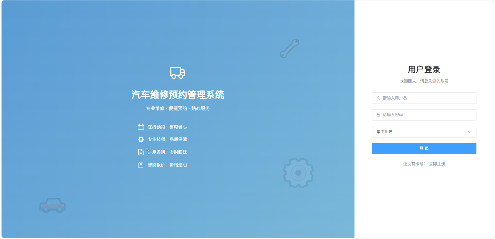
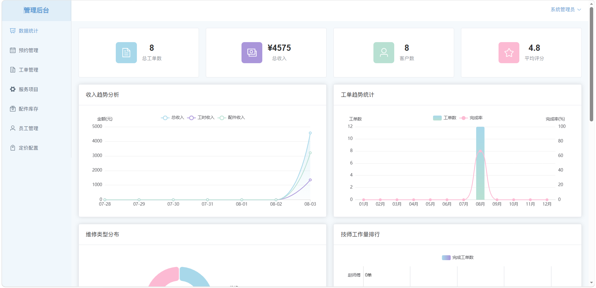
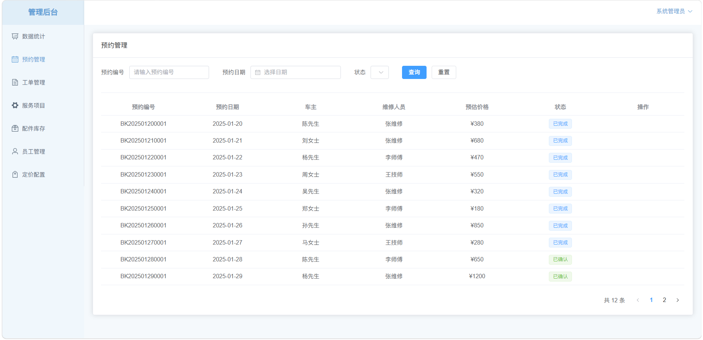
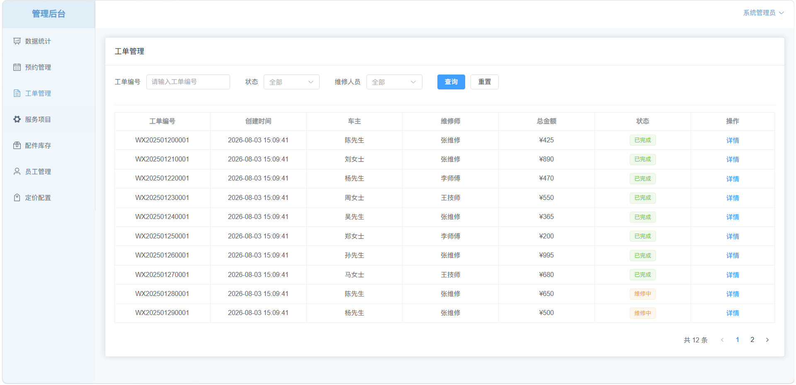
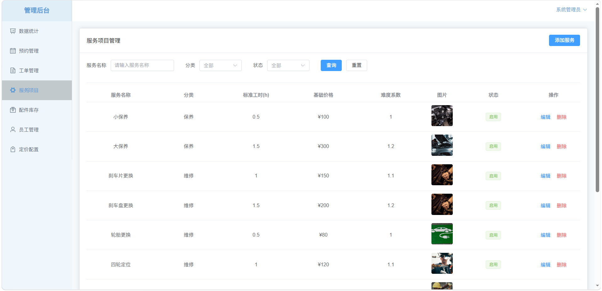
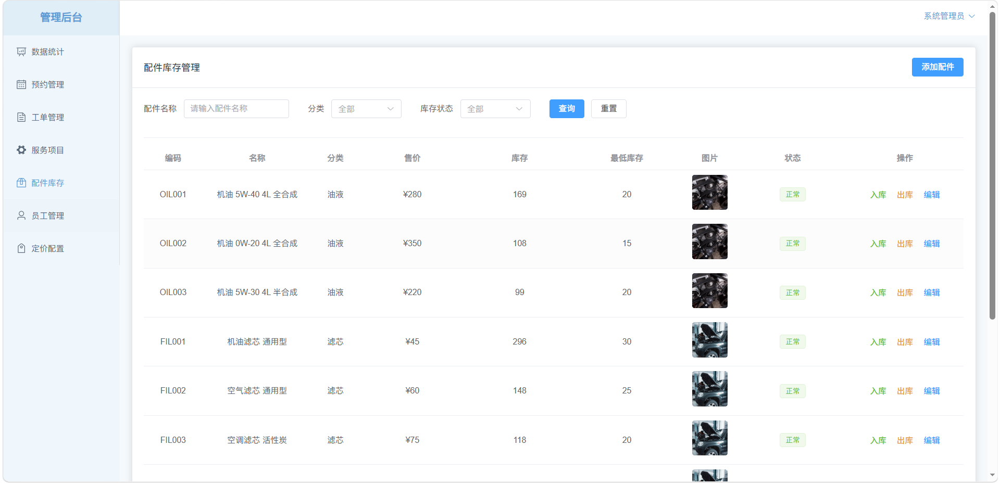
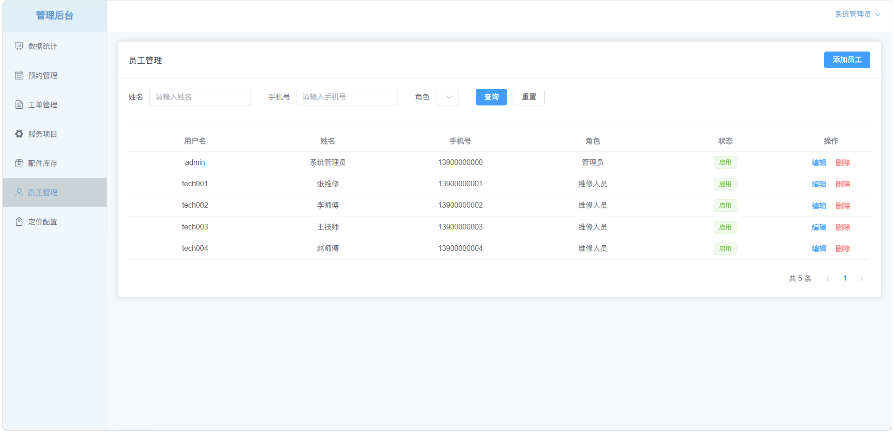
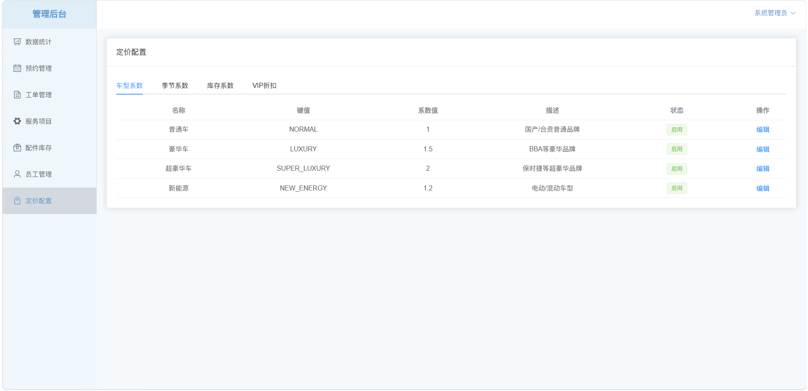
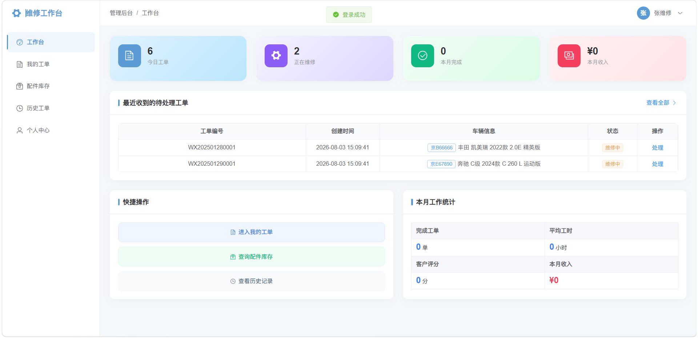
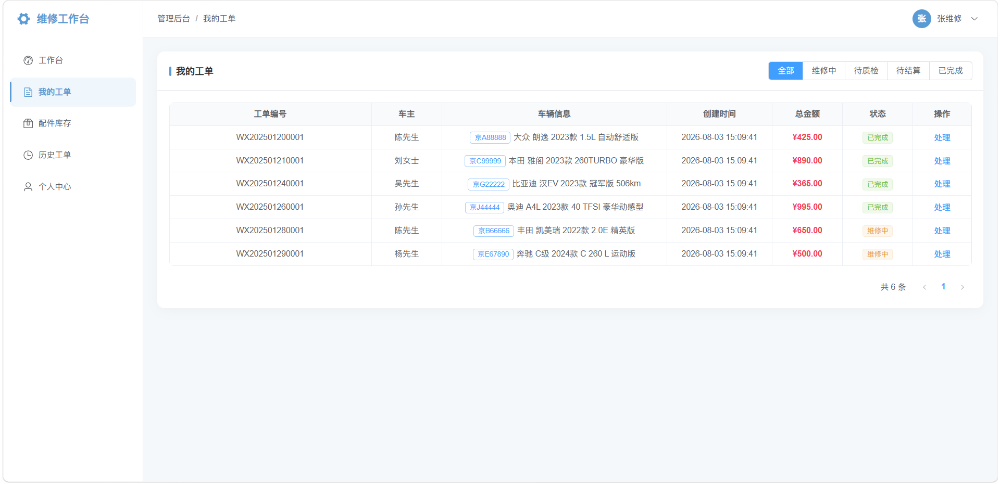
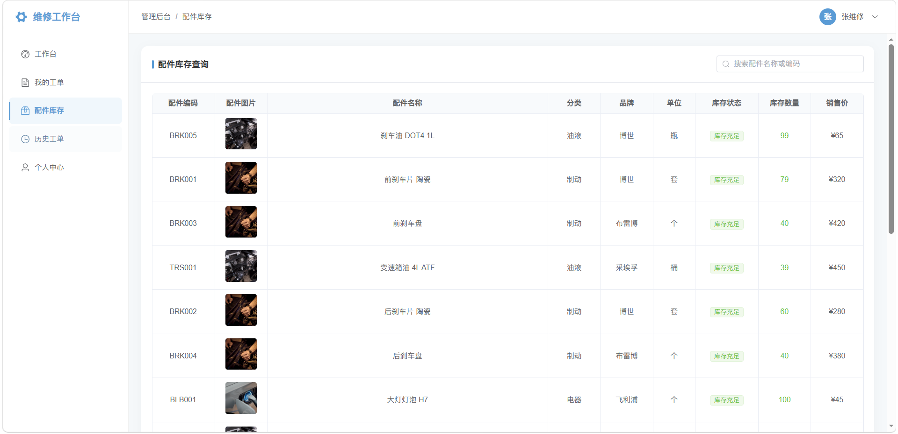
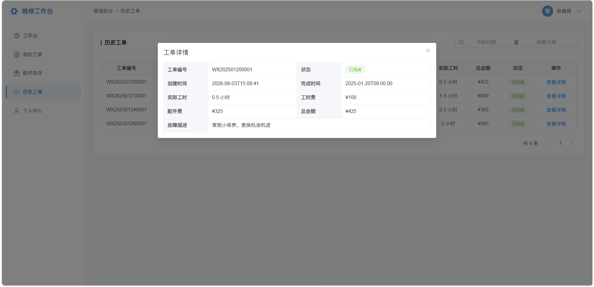
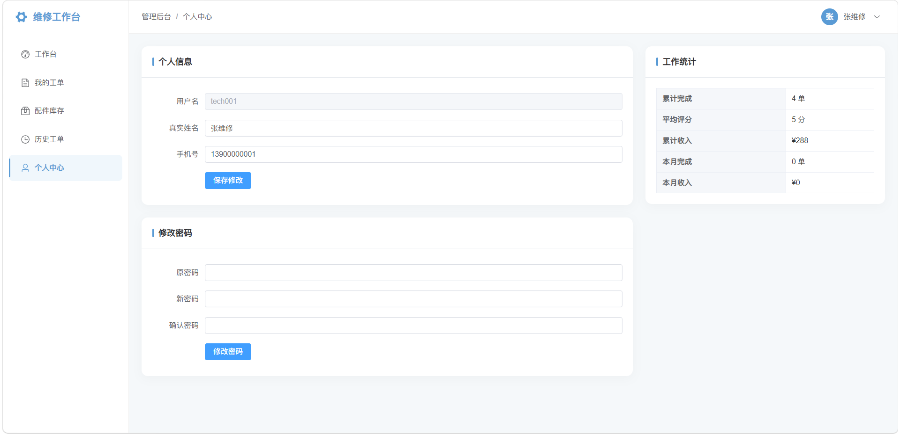
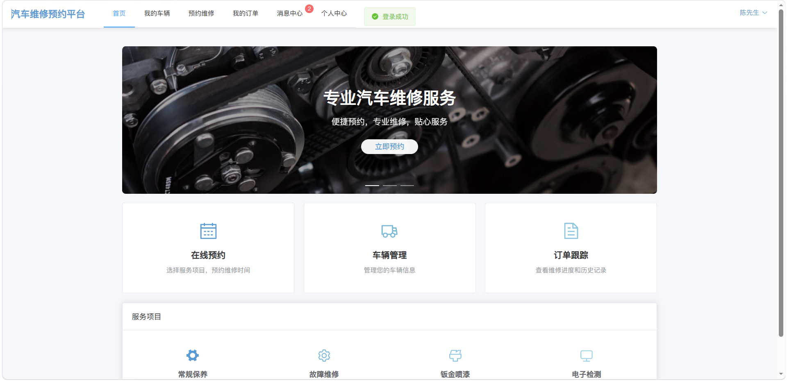
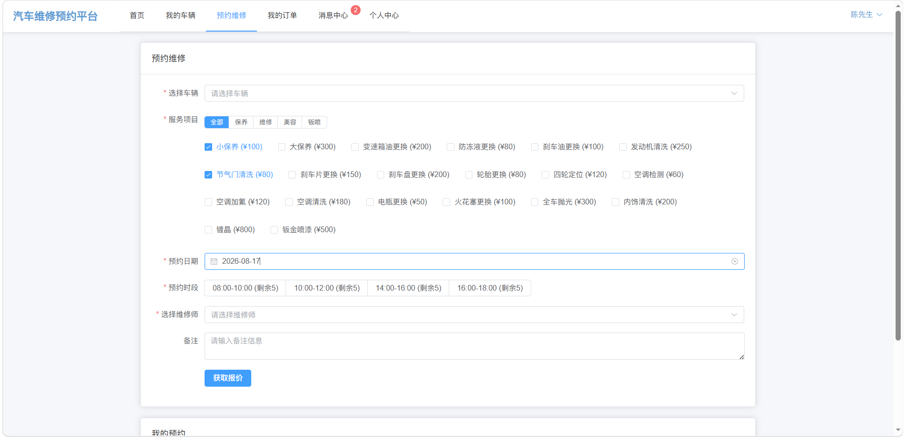
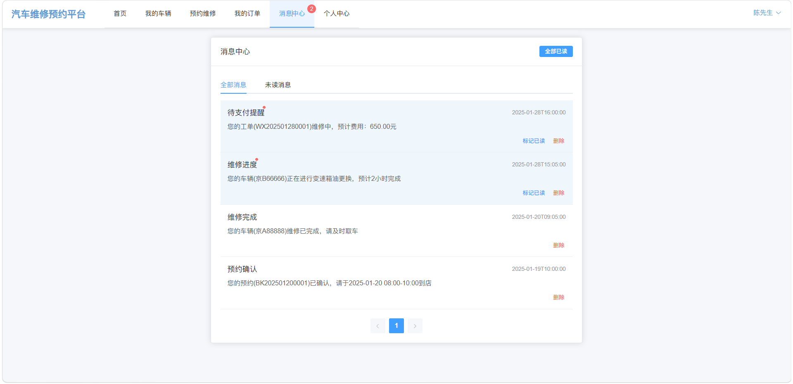

#### 常见问题

1、数据库连接失败：检查 MySQL 是否启动，确认 `application.yml` 中数据库名、账号、密码是否正确。

2、SQL 导入后没有表：请确认 `10-数据库初始化脚本.sql` 已真正导入 `car_repair` 数据库，而不是仅创建了空库。

3、前端构建失败：请检查 Node.js 版本，建议使用 `Node.js 18` 或 `Node.js 20`，避免高版本导致 `vue-tsc` 兼容问题。

4、图片上传或显示失败：请检查后端 `file.upload-path` 配置的上传目录是否存在、是否具有读写权限，以及数据库中的图片路径是否正确。

5、登录提示"登录身份与账号不匹配"：请确认登录时选择的角色与数据库中的账号角色一致（客户 / 维修人员 / 管理员）。

6、WebSocket 消息不推送：请确认前端 Vite 代理已配置 `/ws`，且后端 WebSocket 服务正常启动。
